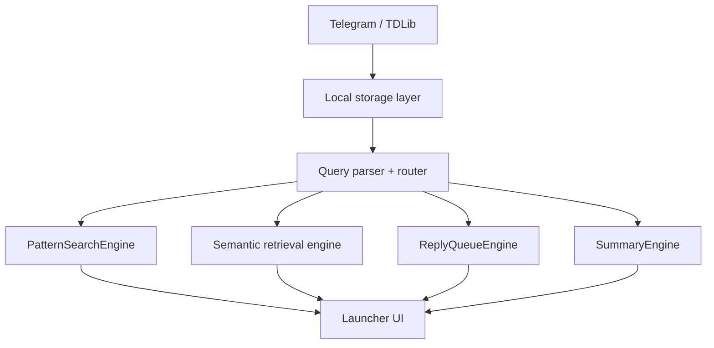
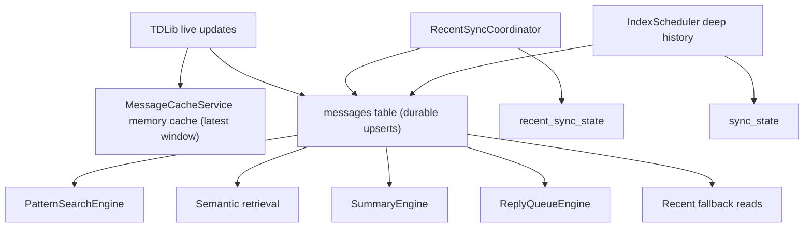

# Pidgy Architecture

Last updated: 2026-04-12

This is a living architecture doc for the launcher-first MVP.

## System Overview

Pidgy is a local-first macOS app built around three layers:

1. local data platform
2. query routing + search engines
3. launcher presentation

At a high level:

## 1. Local Data Platform

### Storage

Primary source of truth is SQLite via:

- [DatabaseManager.swift](/Users/pratyushrungta/telegraham/Sources/Storage/DatabaseManager.swift)
- [Migrations.swift](/Users/pratyushrungta/telegraham/Sources/Storage/Migrations.swift)

Key local stores:

- `messages`
- `sync_state`
- `recent_sync_state`
- FTS tables
- `embeddings`
- graph tables (`nodes`, `edges`)

Current storage semantics:

- `messages` is the durable local history table
- recent hot-cache behavior lives in memory inside [MessageCacheService.swift](/Users/pratyushrungta/telegraham/Sources/Telegram/MessageCacheService.swift)
- recent disk fallback comes from `SELECT ... FROM messages ORDER BY date DESC LIMIT N`
- `sync_state` is owned by deep indexing, not by normal cache refreshes
- `recent_sync_state` is owned by recent-sync freshness, not by deep indexing

At a high level:

### Indexing

Pidgy now treats freshness and deep indexing as separate background concerns.

Fresh recent sync:

- [RecentSyncCoordinator.swift](/Users/pratyushrungta/telegraham/Sources/Indexing/RecentSyncCoordinator.swift)
- keeps the latest message window for active/indexable chats fresh in SQLite
- runs on app startup readiness, app foreground, and explicit chat prioritization
- never mutates `sync_state.is_search_ready`

Deep indexing:

- [IndexScheduler.swift](/Users/pratyushrungta/telegraham/Sources/Indexing/IndexScheduler.swift)
- [EmbeddingService.swift](/Users/pratyushrungta/telegraham/Sources/Indexing/EmbeddingService.swift)
- [VectorStore.swift](/Users/pratyushrungta/telegraham/Sources/Storage/VectorStore.swift)

The current safe default is:

- recent sync prioritizes explicit chat priorities, then newest `lastActivityDate`, with DM/group as a tiebreaker
- deep indexing prioritizes explicit chat priorities, then newest `lastActivityDate`, then DM/group bucket
- deep indexing runs with up to 2 concurrent chat workers
- embedding backfill runs only when the indexing queue is idle, not every N chats in the hot loop
- channels are skipped by default for deep indexing
- both schedulers now publish live progress state into Debug UI so we can see:
  - stale visible chats vs total visible chats
  - active recent-sync refreshes
  - pending deep-index chats
  - active deep-index workers
  - session-level throughput and the last meaningful progress event

### Graph foundation

Relationship graph foundation exists in:

- [RelationGraph.swift](/Users/pratyushrungta/telegraham/Sources/Graph/RelationGraph.swift)
- [GraphBuilder.swift](/Users/pratyushrungta/telegraham/Sources/Graph/GraphBuilder.swift)

This is not yet the main MVP execution path for end-user CRM queries.

## 2. Query Routing Layer

The parser/router is the source of truth for query family selection.

Main files:

- [AIModels.swift](/Users/pratyushrungta/telegraham/Sources/AI/Models/AIModels.swift)
- [QueryInterpreter.swift](/Users/pratyushrungta/telegraham/Sources/AI/QueryInterpreter.swift)
- [QueryRouter.swift](/Users/pratyushrungta/telegraham/Sources/AI/QueryRouter.swift)

Current families:

- `exact_lookup`
- `topic_search`
- `reply_queue`
- `relationship`
- `summary`

Current engines:

- `message_lookup`
- `semantic_retrieval`
- `reply_triage`
- `graph_crm`
- `summarize`

Current routing state:

- the app-side router now reflects the script-first `product_coverage_v2` winner, so broader real-user phrasings for reply queue, summary, relationship, and exact lookup resolve more consistently before any engine logic runs

## 3. Search Engines

### PatternSearchEngine

File:

- [PatternSearchEngine.swift](/Users/pratyushrungta/telegraham/Sources/Search/PatternSearchEngine.swift)

Purpose:

- exact/pattern/entity lookup

Current behavior:

- message-first results
- cheap local retrieval first
- regex/entity verification second
- outgoing bias when query implies `I shared / I sent / I pasted`
- exact structured-token lookups now prefer true token matches over nested/generic fallthroughs
- full URL queries no longer degrade into domain-only matches
- person-scoped artifact queries now require both the artifact evidence and the recipient context, so `wallet I sent to Rahul` prefers the actual Rahul wallet message over generic Rahul chatter
- artifact-transfer phrasings like `wallet I sent to Rahul` now route into `PatternSearchEngine` instead of falling back to topic search
- exact emails, Google Meet codes, platform-specific links, and guarded no-result cases now follow the same verified-artifact rules that won the script-side exact-lookup benchmark

Current supported entity classes:

- exact phrases
- EVM-like addresses
- long address-like strings
- URLs
- domains
- `@handles`

### Semantic retrieval engine

Main orchestration:

- [SearchCoordinator.swift](/Users/pratyushrungta/telegraham/Sources/Views/SearchCoordinator.swift)

Supporting local retrieval:

- [TelegramService.swift](/Users/pratyushrungta/telegraham/Sources/Telegram/TelegramService.swift)
- [VectorStore.swift](/Users/pratyushrungta/telegraham/Sources/Storage/VectorStore.swift)

Purpose:

- concept/topic search

Current behavior:

- FTS + vector merge
- title evidence
- local-only at query time: memory cache + durable SQLite
- clue-aware topical scoring from the promoted `topic_guarded_v3` script winner
- phrase and anchor coverage guards so topic chats need real local evidence, not just nearby generic terms
- weak title-only topical matches are suppressed unless the title match is effectively exact
- split-evidence false positives are rejected when person clues and topic clues only appear in different chats
- optional rerank

### ReplyQueueEngine

File:

- [ReplyQueueEngine.swift](/Users/pratyushrungta/telegraham/Sources/Search/ReplyQueueEngine.swift)

Purpose:

- identify chats where the user likely owes a response

Current behavior:

- coarse local eligibility filter first
- local-only first pass from memory/SQLite
- capped candidate set of 48 chats
- compact deterministic per-chat digests, not raw full chat payloads
- dedicated OpenAI reply-queue model path uses `gpt-5.4-mini`
- AI triage runs in 4 parallel batches of 12 chats
- progressive rendering of confident results while scanning continues
- recent-first ordering

Important current product rule:

- this is a dedicated reply-queue path, not generic semantic search

### SummaryEngine

File:

- [SummaryEngine.swift](/Users/pratyushrungta/telegraham/Sources/Search/SummaryEngine.swift)

Purpose:

- retrieval-first synthesis for prep and recap queries

Current behavior:

- retrieve relevant chats/messages first
- generate one bounded summary card
- render supporting result hits underneath
- time-range filtering is now applied before summary synthesis
- stronger focus gating now prefers the chat that actually contains the recap/decision context instead of generic mention noise
- person-plus-topic summary queries now require a real joint anchor in the same chat, which prevents fake overlaps like `Sophia` in one thread and `wallet addresses` in another from synthesizing into a bad summary

## 4. AI Layer

Main files:

- [AIService.swift](/Users/pratyushrungta/telegraham/Sources/AI/AIService.swift)
- [AIProvider.swift](/Users/pratyushrungta/telegraham/Sources/AI/AIProvider.swift)
- [OpenAIProvider.swift](/Users/pratyushrungta/telegraham/Sources/AI/OpenAIProvider.swift)
- [ClaudeProvider.swift](/Users/pratyushrungta/telegraham/Sources/AI/ClaudeProvider.swift)

Current prompt files:

- [ReplyQueueTriagePrompt.swift](/Users/pratyushrungta/telegraham/Sources/AI/Prompts/ReplyQueueTriagePrompt.swift)
- [QuerySummaryPrompt.swift](/Users/pratyushrungta/telegraham/Sources/AI/Prompts/QuerySummaryPrompt.swift)

Design principle:

- AI should be used for judgment and synthesis
- local retrieval should do as much work as possible before AI is invoked
- reply queue uses a dedicated model path when needed, instead of inheriting the generic OpenAI default model blindly
- launcher search-time networking is an anti-goal; freshness belongs to sync-time, not query-time

## 5. Launcher UI

Main surface:

- [LauncherView.swift](/Users/pratyushrungta/telegraham/Sources/Views/LauncherView.swift)

Coordinator:

- [SearchCoordinator.swift](/Users/pratyushrungta/telegraham/Sources/Views/SearchCoordinator.swift)
- [SearchCoordinator+Agentic.swift](/Users/pratyushrungta/telegraham/Sources/Views/SearchCoordinator+Agentic.swift)

Current UI intent by family:

- exact lookup -> message-first rows
- topic search -> chat-first rows
- reply queue -> action-first rows
- summary -> summary card + supporting rows

Development/debug support exists, but normal launcher UI should stay focused on end-user results.

## Current Runtime Mapping

| Preferred engine | Current runtime behavior |
| --- | --- |
| `message_lookup` | dedicated `PatternSearchEngine` |
| `semantic_retrieval` | local semantic retrieval pipeline |
| `reply_triage` | dedicated `ReplyQueueEngine` for reply-queue queries; older agentic path still exists for non-reply agentic intents |
| `summarize` | dedicated `SummaryEngine` |
| `graph_crm` | recognized but unsupported in MVP runtime |

## Known Architectural Gaps

1. reply queue still leans too hard on local group heuristics in final validation, which can block AI from rescuing true group obligations
2. compact reply-queue digests can over-compress context and hide the original actionable ask in some threads
3. recent sync still needs stronger reconnect/network-recovery triggers beyond startup, foreground, and explicit chat prioritization
4. summary is still single-focus and not true cross-chat synthesis
5. graph/CRM execution is deferred to post-MVP
6. automated coverage now exists for the core regressions, but still needs expansion for recent sync coordinator behavior and reply-queue group-vs-DM fixtures

## Recent Changes

### 2026-04-11

- added `recent_sync_state` to track freshness separately from `sync_state`
- added `RecentSyncCoordinator` to keep active/indexable chats fresh in durable SQLite
- removed search-time Telegram fallbacks from semantic search, exact lookup, and summary paths
- changed deep indexing to use up to 2 concurrent chat workers
- moved embedding backfill off the hot indexing loop and into idle-time work
- improved reply-queue compact digests to preserve latest actionable ask and closure signals
- fixed reply-queue timing accounting for parallel batches
- gated reply-queue candidate snapshot persistence behind an explicit debug preference
- added a small XCTest target covering durable history, recent-sync readiness preservation, query routing, and summary time windows

### 2026-04-08

- made `messages` the durable local history table instead of a trim-to-50 disk cache
- kept hot recent-message behavior in memory, not in SQLite trimming paths
- stopped normal live/cache writes from mutating `sync_state`
- made cache invalidation memory-only instead of wiping chat history from disk
- verified live append and delete behavior against the real SQLite DB

### 2026-04-07

- added dedicated MVP engines for exact lookup, reply queue, and summary
- made query routing the source of truth for launcher execution
- changed reply queue to progressive rendering of confident rows
- changed reply queue ordering to recent-first
- hid heavy debug overlays from the main launcher UI

## Related Docs

- [Product PRD](/Users/pratyushrungta/telegraham/docs/product-prd.md)
- [Task Tracker](/Users/pratyushrungta/telegraham/docs/task-tracker.md)
- [Query Engine Matrix](/Users/pratyushrungta/telegraham/docs/query-engine-matrix.md)
