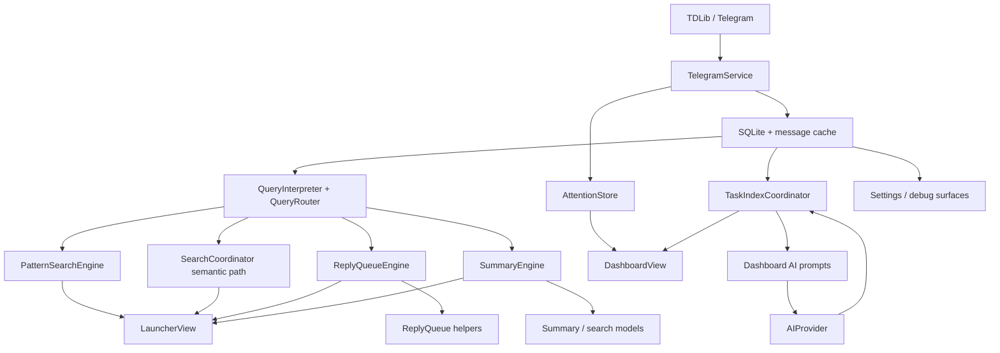
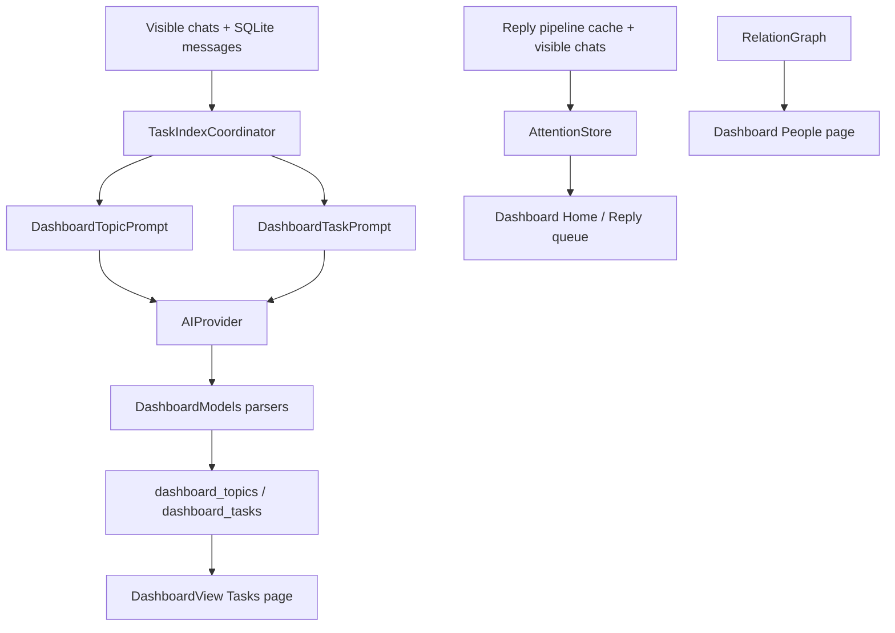

# Pidgy Architecture

Last updated: 2026-04-27

Pidgy is a local-first macOS app for operating Telegram relationship context without turning Telegram into a full CRM. The launcher is still the fastest query surface; the dashboard is now a secondary operating surface for attention, extracted tasks, and relationship context.

## System Shape

The runtime is organized into five practical layers:

1. App shell and presentation
2. Telegram sync and local data
3. Query planning and search engines
4. Dashboard task / attention indexing
5. Shared search / follow-up domain logic

## 1. App Shell

Primary entry points:

- [PidgyApp.swift](/Users/pratyushrungta/telegraham/Sources/App/PidgyApp.swift)
- [AppDelegate.swift](/Users/pratyushrungta/telegraham/Sources/App/AppDelegate.swift)
- [PanelManager.swift](/Users/pratyushrungta/telegraham/Sources/App/PanelManager.swift)
- [MenuBarManager.swift](/Users/pratyushrungta/telegraham/Sources/App/MenuBarManager.swift)
- [HotkeyManager.swift](/Users/pratyushrungta/telegraham/Sources/App/HotkeyManager.swift)

Responsibilities:

- boot the menu bar app / debug-window mode
- initialize the database before Telegram startup
- restore credentials and start TDLib if available
- start recent sync, graph build, and deep indexing only after auth + initial chat readiness
- manage launcher, dashboard, and settings presentation

Current rule: startup orchestration lives in `AppDelegate`; search and dashboard extraction logic does not. `AppDelegate` opens the dashboard window, wires the menu/launcher dashboard actions, and starts `TaskIndexCoordinator` after Telegram readiness.

## 2. Telegram Sync And Local Data

Core files:

- [TelegramService.swift](/Users/pratyushrungta/telegraham/Sources/Telegram/TelegramService.swift)
- [MessageCacheService.swift](/Users/pratyushrungta/telegraham/Sources/Telegram/MessageCacheService.swift)
- [DatabaseManager.swift](/Users/pratyushrungta/telegraham/Sources/Storage/DatabaseManager.swift)
- [Migrations.swift](/Users/pratyushrungta/telegraham/Sources/Storage/Migrations.swift)
- [RecentSyncCoordinator.swift](/Users/pratyushrungta/telegraham/Sources/Indexing/RecentSyncCoordinator.swift)
- [IndexScheduler.swift](/Users/pratyushrungta/telegraham/Sources/Indexing/IndexScheduler.swift)
- [EmbeddingService.swift](/Users/pratyushrungta/telegraham/Sources/Indexing/EmbeddingService.swift)
- [VectorStore.swift](/Users/pratyushrungta/telegraham/Sources/Storage/VectorStore.swift)

Storage rules:

- `messages` is the durable source of local history.
- `MessageCacheService` is the hot recent window, not the long-term source of truth.
- `recent_sync_state` tracks launcher freshness.
- `sync_state` tracks deep-index readiness.
- `dashboard_topics`, `dashboard_tasks`, `dashboard_task_sources`, and `dashboard_task_sync_state` persist dashboard operating state.
- search-time networking is an anti-goal; the launcher should search local state.

Freshness model:

- `RecentSyncCoordinator` keeps active / visible chats fresh.
- `IndexScheduler` handles deeper backfill and embeddings.
- both publish progress used by Settings debug UI.

## 3. Query Planning And Search Execution

Planning / routing files:

- [QueryInterpreter.swift](/Users/pratyushrungta/telegraham/Sources/AI/QueryInterpreter.swift)
- [QueryRouter.swift](/Users/pratyushrungta/telegraham/Sources/AI/QueryRouter.swift)
- [SearchCoordinator.swift](/Users/pratyushrungta/telegraham/Sources/Views/SearchCoordinator.swift)
- [SearchCoordinator+Agentic.swift](/Users/pratyushrungta/telegraham/Sources/Views/SearchCoordinator+Agentic.swift)

Current query families:

- `exact_lookup`
- `topic_search`
- `reply_queue`
- `summary`
- `relationship` is recognized, but still not a shipped end-user engine

Execution ownership:

- [PatternSearchEngine.swift](/Users/pratyushrungta/telegraham/Sources/Search/PatternSearchEngine.swift)
  - exact / literal / entity retrieval
- [SearchCoordinator.swift](/Users/pratyushrungta/telegraham/Sources/Views/SearchCoordinator.swift)
  - semantic/topic local retrieval and optional rerank orchestration
- [ReplyQueueEngine.swift](/Users/pratyushrungta/telegraham/Sources/Search/ReplyQueueEngine.swift)
  - ownership / reply-now triage
- [SummaryEngine.swift](/Users/pratyushrungta/telegraham/Sources/Search/SummaryEngine.swift)
  - retrieval-first recap / prep synthesis

Important boundary:

- `SearchCoordinator` is the launcher orchestration boundary.
- engine-specific heuristics should live in the engine or shared search-domain helpers, not in the launcher view.

## 4. Dashboard Task / Attention Indexing

Dashboard files:

- [DashboardView.swift](/Users/pratyushrungta/telegraham/Sources/Dashboard/DashboardView.swift)
- [TaskIndexCoordinator.swift](/Users/pratyushrungta/telegraham/Sources/Dashboard/TaskIndexCoordinator.swift)
- [AttentionStore.swift](/Users/pratyushrungta/telegraham/Sources/Dashboard/AttentionStore.swift)
- [DashboardModels.swift](/Users/pratyushrungta/telegraham/Sources/Dashboard/DashboardModels.swift)
- [DashboardPrompt.swift](/Users/pratyushrungta/telegraham/Sources/AI/Prompts/DashboardPrompt.swift)

Current dashboard responsibilities:

- show a calm operating view over four pages: Dashboard, Reply queue, Tasks, People
- reuse reply/follow-up pipeline state through `AttentionStore`
- discover a small topic taxonomy from recent local messages
- extract durable tasks from recent per-chat local message windows
- preserve manual task status across extraction refreshes
- show task evidence snippets and deep-link back to Telegram
- surface graph-derived top/stale contacts as context, not as a full CRM engine

Dashboard data flow:

Important boundaries:

- Dashboard extraction reads local state; it should not fetch Telegram history inline.
- Task extraction is a background indexing concern, separate from launcher query execution.
- Dashboard tasks are not yet a complete task lifecycle engine. Today the code can insert/update positive task candidates and preserve manual status, but launch hardening still needs stale/closed task reconciliation so old open tasks do not linger forever.
- Dashboard refresh currently runs on a timer and through manual refresh. Any product launch should include a clear user-facing cost/freshness story because dashboard extraction uses AI.

## 5. Shared Search / Follow-Up Domain Logic

The repo had accumulated several shared concepts inside view files. As of the 2026-04-20 cleanup pass, these live closer to the search domain:

- [SearchModels.swift](/Users/pratyushrungta/telegraham/Sources/Search/Models/SearchModels.swift)
  - cross-engine result models and shared chat eligibility filtering
- [AgenticDebugModels.swift](/Users/pratyushrungta/telegraham/Sources/Search/Models/AgenticDebugModels.swift)
  - shared debug payloads consumed by search engines, coordinator, and launcher UI
- [ConversationReplyHeuristics.swift](/Users/pratyushrungta/telegraham/Sources/Search/ReplyQueue/ConversationReplyHeuristics.swift)
  - reply / ownership heuristics and shared signal evaluation
- [FollowUpPipelineAnalyzer.swift](/Users/pratyushrungta/telegraham/Sources/Search/ReplyQueue/FollowUpPipelineAnalyzer.swift)
  - launcher follow-up categorization extracted out of `LauncherView`

This is intentional: reply-queue and follow-up behavior are search-domain concerns, not view concerns.

## 6. Launcher, Dashboard, And Settings UI

Primary UI files:

- [LauncherView.swift](/Users/pratyushrungta/telegraham/Sources/Views/LauncherView.swift)
- [DashboardView.swift](/Users/pratyushrungta/telegraham/Sources/Dashboard/DashboardView.swift)
- [SettingsView.swift](/Users/pratyushrungta/telegraham/Sources/Views/SettingsView.swift)
- [QueryRoutingDebugSnapshot.swift](/Users/pratyushrungta/telegraham/Sources/Views/Settings/QueryRoutingDebugSnapshot.swift)
- [Components](/Users/pratyushrungta/telegraham/Sources/Views/Components)

Launcher responsibilities:

- query input and result rendering
- pipeline badge state
- chat opening / deep-link actions
- delegating search and follow-up analysis to coordinator / service layers

Dashboard responsibilities:

- provide a scannable daily operating view
- combine reply queue, extracted tasks, and people context without replacing Telegram
- expose task status actions: done, snooze, ignore, open chat

Settings responsibilities:

- credentials and AI configuration
- usage/debug surfaces
- query routing inspection
- destructive reset controls

Current architectural debt still visible:

- `LauncherView` remains too large and still mixes multiple result presentations.
- `DashboardView` is now the largest UI file and mixes page composition, filters, row/detail views, theme, and local dashboard view models.
- `SettingsView` still owns tab rendering plus a large amount of debug/formatting code.
- `SearchCoordinator` still contains the full semantic/topic path inline.
- `DatabaseManager` now owns both core message storage and dashboard persistence helpers; dashboard storage can be extracted once launch behavior settles.

## 7. Graph Foundation

Files:

- [GraphBuilder.swift](/Users/pratyushrungta/telegraham/Sources/Graph/GraphBuilder.swift)
- [RelationGraph.swift](/Users/pratyushrungta/telegraham/Sources/Graph/RelationGraph.swift)

Status:

- real runtime foundation
- used by startup / debug flows
- not the primary MVP execution path for launcher queries

Treat this as foundation, not dead code.

## 8. Current Cleanup Direction

The active architecture direction is:

1. keep local-first retrieval and launcher speed intact
2. centralize duplicated reply / eligibility logic
3. treat dashboard as a secondary operational surface, not a full CRM rewrite
4. move shared models out of UI-heavy files
5. keep graph/relationship foundations, but document them as supporting context until graph-backed execution is real
6. continue breaking large UI/coordinator files into smaller focused units without rewriting product behavior
7. make dashboard task lifecycle and AI cost/freshness behavior explicit before launch

## 9. What Is Intentionally Not Core Right Now

Not core to current architecture decisions:

- send automation
- full CRM pipeline management
- graph-backed end-user CRM query execution
- search-time Telegram fetches as a normal query path
- autonomous reminders or proactive outreach

The codebase should optimize for trustworthy local retrieval, ownership judgment, and dashboard task evidence before broad CRM automation.
