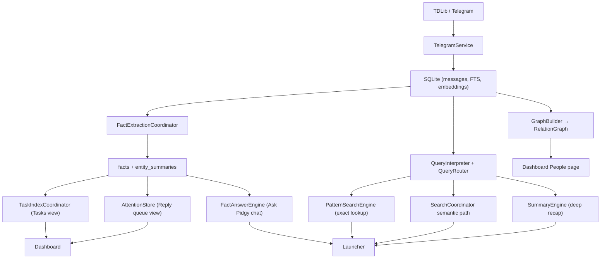

# Pidgy Architecture

Last updated: 2026-07-21 (post context-layer refactor, commit `b963b7a`)

Pidgy is a local-first macOS app for operating Telegram relationship context
without turning Telegram into a full CRM. The launcher is the fastest query
surface; the dashboard is the operating surface for replies, tasks, topics,
and people.

The defining shift since the last revision: **one fact store now powers the
product.** The old per-surface AI pipelines (agentic reply-queue search, AI
task triage/extraction, pipeline-category cache) are deleted — tasks and the
reply queue are pure *views* over extracted facts, and the launcher's "Ask
Pidgy" chat answers from the same store.

## System Shape

1. App shell and presentation
2. Telegram sync and local data
3. Context layer (facts) — extraction, projection, answering
4. Query planning and search engines
5. Dashboard and launcher UI

```mermaid
flowchart TD
    A["TDLib / Telegram"] --> B["TelegramService"]
    B --> C["SQLite (messages, FTS, embeddings)"]
    C --> X["FactExtractionCoordinator"]
    X --> Y["facts + entity_summaries"]
    Y --> T["TaskIndexCoordinator (Tasks view)"]
    Y --> R["AttentionStore (Reply queue view)"]
    Y --> AE["FactAnswerEngine (Ask Pidgy chat)"]
    C --> D["QueryInterpreter + QueryRouter"]
    D --> E["PatternSearchEngine (exact lookup)"]
    D --> F["SearchCoordinator semantic path"]
    D --> H["SummaryEngine (deep recap)"]
    T --> N["Dashboard"]
    R --> N
    AE --> J["Launcher"]
    E --> J
    F --> J
    H --> J
    C --> G["GraphBuilder → RelationGraph"]
    G --> P["Dashboard People page"]
```

## 1. App Shell

Entry points: `Sources/App/` — `PidgyApp`, `AppDelegate`, `PanelManager`,
`MenuBarManager`, `HotkeyManager`.

Responsibilities:

- boot the menu bar app / dashboard window
- initialize the database before Telegram startup
- restore credentials and start TDLib if available
- start, in order: recent sync → major-chat coverage → index scheduler →
  task-view coordinator → **FactExtractionCoordinator** → graph build loop
- manage launcher, dashboard, and preferences presentation

Startup orchestration lives in `AppDelegate`; extraction and search logic do
not.

## 2. Telegram Sync And Local Data

Core files: `Sources/Telegram/` (`TelegramService`, `RateLimiter`,
`MessageCacheService`), `Sources/Indexing/` (`RecentSyncCoordinator`,
`MajorChatCoverageCoordinator`, `IndexScheduler`, `EmbeddingService`,
`PhotoOCRIndexer`), `Sources/Storage/`.

`DatabaseManager` is one actor split across domain extension files:

| File | Owns |
|---|---|
| `DatabaseManager.swift` | init/migrations glue, shared statics, generic read/write |
| `+Messages` | messages CRUD, live upserts (incl. structural reply-close hook) |
| `+SyncState` | recent-sync, coverage, deep-index cursors |
| `+Search` | FTS raw queries, searchable-message loads |
| `+Embeddings` | chunking + embedding state |
| `+Facts` | the context layer's fact store (see §3) |
| `+Summaries` | rolling per-chat entity summaries |
| `+Topics` | user-curated dashboard topics |
| `+People` | person profiles, sender backfill |
| `+OCR` | on-device photo OCR state (`[photo text: …]` appends) |

Storage rules:

- `messages` is the durable source of local history; `MessageCacheService`
  is only the hot recent window.
- `facts` + `entity_summaries` are the context layer's derived store —
  bi-temporal (invalidate, never overwrite), fingerprint-deduped.
- `dashboard_topics` is user-curated. (The legacy `pipeline_cache` +
  `dashboard_task_sync_state` tables were dropped in migration v33;
  `dashboard_tasks`/`_sources` and the dev-era `facts_backup_*` copies
  in v34.)
- Search-time networking is an anti-goal; the launcher searches local state.
- `RateLimiter` is the only flood-safety boundary for TDLib calls, with a
  fast lane for user-facing downloads (avatars) over background work (OCR).

## 3. Context Layer (Facts) — the core

Files: `Sources/Context/` — `ContextLayer` (flag + vocabulary),
`FactExtraction` (prompt + parser), `FactExtractionCoordinator` (crawl),
`FactProjections` (views), `FactAnswerEngine` (Ask Pidgy prompt),
`FactEntityResolver`, `SummaryFold`, `VoiceProfileService`.

The model:

- A **fact** is a subject–predicate–object triple with provenance (source
  chat/message/text) and a bi-temporal validity window. Open-loop predicates
  (`i_owe`, `owes_me`) ARE the product's tasks and reply queue.
- `i_owe` loops carry a **loopKind**: `reply` (closable by sending a message
  now — the Reply queue) vs `action` (needs real work — Tasks).
- **Structural close, never content-based:** any later outgoing message in
  the chat closes a reply-kind loop (live on send, per-window sweep, and a
  pass-start heal). Action loops and `owes_me` never close on the user's own
  message.
- **Rolling entity summaries** fold each chat's history into one living
  paragraph (forward-paginated, folded in batches once enough unfolded
  messages accumulate).

Views over the store:

- `TaskIndexCoordinator` — projects open + user-closed facts into the Tasks
  page. Pure load/re-project; generation-guarded so overlapping loads can't
  publish stale snapshots. Status changes invalidate/reopen facts.
- `AttentionStore` — projects reply lanes (`FactProjection.replyLanes`) into
  the Reply queue. Leading+trailing debounce; the running projection is never
  cancelled mid-read (a coalesced rerun queues instead).
- `FactAnswerEngine` — the Ask Pidgy chat's grounded prompt: open loops
  (tagged `I OWE · REPLY` / `I OWE · TASK` / `OWES ME`), durable facts, and
  entity summaries, with `pidgy://chat/<id>` backlinks and conversation
  history for follow-ups.

**Kill-switch semantics** (Preferences → Memory engine, read once per
launch): OFF stops fact extraction (no AI spend). The views keep projecting
the last-known facts — they freeze; there is **no legacy-pipeline fallback**
(that code is deleted).

## 4. Query Planning And Search Execution

Files: `Sources/AI/` (`QueryInterpreter`, `QueryRouter`, `AIService`,
providers), `Sources/Views/SearchCoordinator.swift`, `Sources/Search/`.

Routing is one table: `QueryFamily.preferredEngine` +
`QueryEngine.runtimeMode` (in `AIModels.swift`) — the interpreter's
deterministic parse and the router's planner merge both consume it.

| Family | Engine | Surface |
|---|---|---|
| `exact_lookup` | `PatternSearchEngine` | literal/artifact rows |
| `topic_search` | local semantic (FTS variants + vectors, RRF-fused, optional rerank) | ranked chats |
| `reply_queue` | local semantic **+ Ask Pidgy chat auto-open** | answer from REPLY loops |
| `summary` (person question) | local semantic **+ Ask Pidgy chat auto-open** | answer card is the summary |
| `summary` (chat recap) | `SummaryEngine` | deep map-reduce recap |
| `relationship` | recognized, not shipped | — |

`QuerySpec.isAnswerEngineQuestion` is THE single definition of "the Ask
Pidgy chat owns this query" (summary-family person questions + reply-queue
family), shared by the router and the launcher auto-open. The launcher
observes `SearchCoordinator.resolvedQuerySpec` (published only after the
planner resolves, from inside the search task) — never the per-keystroke
deterministic spec.

## 5. Dashboard And Launcher UI

Dashboard: `Sources/Dashboard/` — `DashboardView` (shell + navigation),
Home (blended task/reply feed, deduped by chat), Reply queue, Tasks, Topics
(editorial catch-me-up + fused topic search), People (RelationGraph), and
Preferences (`DashboardPreferencesPage` + `DashboardPreferenceAtoms` design
atoms + `DashboardPreferenceDiagnostics` debug components).

Launcher: `Sources/Views/` — `LauncherView` (input, filters, results,
keyboard nav), `AskPidgyChat` (chat model + thread UI, shared with the
dashboard entry), `LauncherSupport` (preview resolver, onboarding handoff),
`SearchCoordinator` (orchestration boundary — engine heuristics live in
engines, not the view).

Onboarding: `Sources/Onboarding/` — flow container + `WelcomeTour`,
`AuthSteps`, `ConnectSteps`, `PlanSteps`.

## 6. Graph Foundation

`Sources/Graph/` — `GraphBuilder` populates `RelationGraph` (SQLite
nodes/edges) for the People page. Deliberately kept as supporting context;
not a query-execution path. (Known debt: its rebuild loop is timer-driven —
issue #61.)

## 7. AI Cost And Model Routing

- All managed-plan calls go through the Cloudflare AI proxy
  (`infra/ai-proxy/`, Vertex path for Gemini). BYOK users hit their own
  provider directly.
- Every call is tagged with an `AIRequestKind` (fact extraction, answer
  engine, planner, semantic search, summaries…) for per-stage metering and
  per-stage model routing (`AppConstants.AI.managedModelOverride`).
  Legacy kinds are retained so historical usage logs still decode.
- Fold + extraction frequency is throttled (accumulation thresholds,
  windowed crawls, parallel chat crawl with sequential windows per chat).

## 8. Testing

`Tests/PidgyCoreTests.swift` — 196 tests, offline (mock providers, temp
databases). The remaining skips are documented SummaryEngine scoring
regressions gated on eval-validated fixes (issue #59). Injection defenses
are code-level gates, tested (destructive AI routes never act on
uncorroborated model output).

## 9. Current Direction

CI (`.github/workflows/ci.yml`) runs a secret scan + the full suite on
every PR and push to main. Remaining work, tracked in GitHub issues:

1. SummaryEngine retrieval regressions (#59)
2. Central AI scheduler — one queue/budget for all AI calls (#60)
3. Retire remaining idle polling loops (#61)
4. Constructor injection over `.shared` as a standing convention (#62)
5. Release preflight assert for the bundled proxy URL (#63)
6. Graceful reply-queue degraded mode when AI is off (#64)
7. Auto-expiry decision for stale fact tasks (#65)

## 10. What Is Intentionally Not Core

- send automation, autonomous reminders, proactive outreach
- full CRM pipeline management / graph-backed CRM queries
- search-time Telegram fetches as a normal query path

Optimize for trustworthy local retrieval, ownership judgment, and grounded
answers before any automation.
